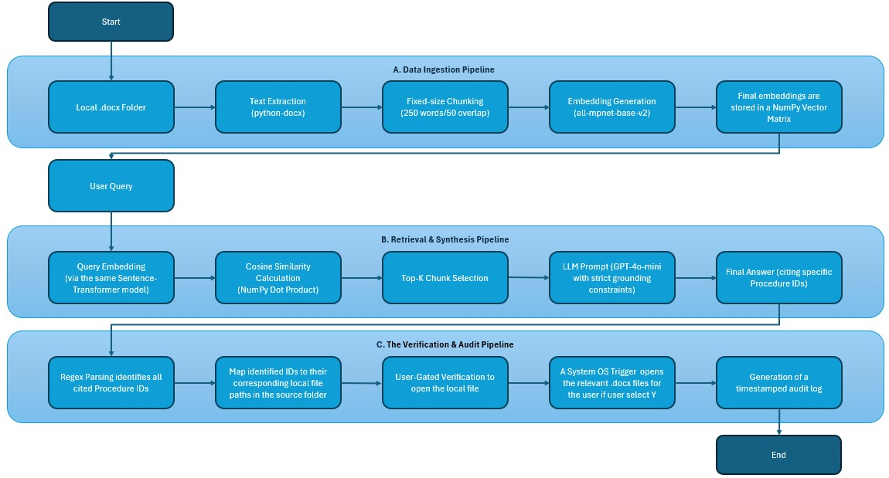

# OperationalRAG

## Overview
OperationalRAG is a localized Retrieval-Augmented Generation (RAG) system designed for banking operational procedures. It allows users to index a local folder of `.docx` files and query them using natural language, ensuring all answers are grounded in the provided documents with a full audit trail.

## A. PRODUCT DOCUMENTATION

### 1. Persona
User: Kai, a Junior Operational Banking Officer.

Scenario: Kai must process an unfamiliar payment before a strict one-hour cutoff. Unable to reach his manager, he must locate specific steps across 30+ dense procedures. OperationalRAG reduces this retrieval time from ~30 minutes of manual scanning to seconds of auditable retrieval.

### 2. Inputs and outputs
| Component | Description |
| :--- | :--- |
| **Input (Data)** | A local directory containing `.docx` procedural documents. |
| **Input (User)** | Natural language queries regarding banking operations. |
| **Output (AI)** | A grounded answer citing specific Procedure IDs (e.g., PAY-OPS-001). |
| **Output (Audit)** | A generated `.docx` log containing the query, AI response, and raw retrieved chunks. |
| **Output (UX)** | Direct system trigger to open source files for human-in-the-loop verification. |

### 3. Product architecture

### 4.Evaluation Methodology
To validate the system, I implemented a rigorous testing pipeline:
*   **Synthetic Data Generation:** Used GenerateProcedures.py to create a domain-specific banking corpus of 30 SOPs.
*   **Ground Truth Definition:** Created a curated set of 50 test cases across 10 complexity categories (e.g., Multi-Hop, Adversarial) using CreateCaseJSON.py.
*   **Lexical Baseline:** Ran NonAI_Baseline_BM25.py to establish a performance floor using BM25 keyword search.
*   **RAG Validation:** Executed 150 trials via RunRag.py, utilizing an LLM-as-a-Judge (claude-haiku-4.5) to ensure factual equivalence between generated answers and the ground truth.

### 5. Metrics Performance
*   **Target Metric:** Improve upon Lexical Search (BM25) Top-1 Accuracy and reduce "Hallucinations" in a banking context.
*   **Baseline (BM25):** 40% Accuracy.
*   **Reached (OperationalRAG):** 66% Accuracy.
*   **Key Win:** Vocabulary Mismatch performance rose from 20% (BM25) to 60% (RAG).

## B. Technical Instruction
### 1. Environment
- **Python Version:** 3.9+
- **OS:** Windows (Optimized for `os.startfile`), macOS, or Linux.

### 2. Dependencies
Install the required libraries via pip:

pip install numpy sentence-transformers openai python-docx pandas bm25s requests

### 3. API Configuration
OperationalRAG uses OpenRouter to access gpt-4o-mini.
Edit in the Environment Variable and set OPENROUTER_API_KEY='your_key_here'

### 4. How to Run - OperationalRAG_Prototype.py
1. Ensure you have a folder containing the .docx procedural documents (e.g., the /procedures folder provided in the repo).
2. Run OperationalRAG_Prototype.py
3. Index Folder: When prompted, enter the full path to your procedures folder.
4. Query: Enter a natural language question (e.g., "How do I handle an urgent payment cutoff?").
5. Verify: The system will provide an answer and ask if you wish to open the cited .docx files immediately for manual verification.
6. Audit: Every query is automatically saved as a timestamped document in the /Log folder.

### 5. How to Run - Evals
1. Run GenerateProcedures.py to generate 30 SOPs in the /procedures folder
2. Run CreateCaseJSON.py to generate 50 test cases in /results (Output: eval_50_cases.JSON, eval_50_cases.CSV )
3. Run NonAI_Baseline_BM25.py to get NonAI Baseline results in /results (Output: bm25_baseline_results.JSON, bm25_baseline_results.CSV and category_pass_rates.csv)
4. Run RunRag.py to get the RAG results with LLM-as-a-Judge (claude-haiku-4.5) in /results (Output: eval_detailed_results.CSV, eval_detailed_results.JSON)
